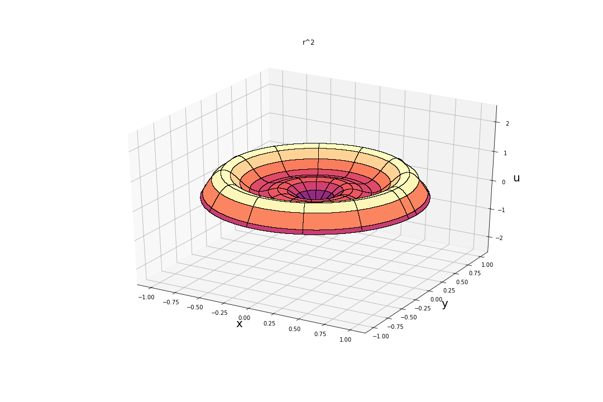

# DrumSim
Simulates the surface of a perfectly elastic circular drum upon impingement by an arbitrary disturbance. 


```python
from drumsim import Mode, CircularDrum
```

# Drum Vibrations: Analysis

## Modal Dynamics and Relations


```python
# Generate all modes up to (3,4)
for m in range(0,4):
    for n in range(1,5):
        Mode(m,n,r=1,c=1).sim(fpath = './Modes')
```
### The *n* parameter
* Below we observe that as *n* increases, so too does the number of circular node, that is, circles where the drum displacement is stationary at all times.
* In the (0,1) case, there exists only the one circular node at the fixed rim of the drum which explains why *n* must begin at 1: there is always the one circular node conferred by the boundary condition. This is analogous to the modes of a vibrating guitar string always having two nodes at both ends.
* For (0,2), another circular node has been added close to half the radial lenght of the drum, resulting in outer and inner anti-oscillating regions. 
* Finally, (0,4) shows four concentric nodes - as expected.


|(0,1)|(0,2)| 
|---|---|
|.gif)|.gif)|

|(0,3)|(0,4)|
|---|---|
|.gif)|.gif)|


### The *m* parameter
* Below we observe that *m* corresponds to the number of diametral nodes: lines along the diameter where the drum displacement is stationary at all times.
* In the (0,1) case (above), there exists no linear node which explains why *m* may begin at 0.
* For (1,1), a single diameter has been added resulting in anti-oscillating regions at either half of the drum.
* (4,1) shows four (radially equidistant) diametric lines

|(1,1)|(2,1)| 
|---|---|
|.gif)|.gif)|

|(3,1)|(4,1)|
|---|---|
|.gif)|.gif)|


## General Solution: Axisymmetric Pertubration

**Please note I've included a damping factor to make simulations more reflective of dissipation**
* To start off simple, let us observe solutions under initial conditions that possess radial symmetry
* Consider a reflected quadratic *u0(r) = -r(r-1)* whose vertex is halfway radially outwards from the drum's centre

```python
def u0(r, theta):
    return -r*(r-1)
```

* For such an initial shape, the drum evolves accordingly:


```python
drumquaddown = CircularDrum(radius=1, c=1, u0=u0, maxm=5,maxn=4)
drumquaddown.sim(fname="-r(r-1)", fpath="Final\General\Axisymmetric")
```

|Initial|Evolution|
|---|---|
|.png)|.gif)|

* Let us try with more initial conditions:

```python
drumquadup = CircularDrum(radius=1, c=1, u0=lambda r,theta: r**2, maxm=5,maxn=4)
drumquadup.sim(fname="r^2", fpath="Final\General\Axisymmetric")
drumquadup.simInitial(fname="r^2", fpath="Final\General\Axisymmetric")

drumsin = CircularDrum(radius=1, c=1, u0=lambda r,theta: np.sin(2*np.pi*r), maxm=5,maxn=4)
drumsin.sim(fname="sin(2pir)", fpath="Final\General\Axisymmetric")
drumsin.simInitial(fname="sin(2pir)", fpath="Final\General\Axisymmetric")

drumlinear = CircularDrum(radius=1, c=1, u0=lambda r,theta: r, maxm=5,maxn=4)
drumlinear.sim(fname="r", fpath="Final\General\Axisymmetric")
drumlinear.simInitial(fname="r", fpath="Final\General\Axisymmetric")

drumcubic = CircularDrum(radius=1, c=1, u0=lambda r,theta: -(r-1/2)**3, maxm=5,maxn=4)
drumcubic.sim(fname="-(r-0.5)^3", fpath="Final\General\Axisymmetric")
drumcubic.simInitial(fname="-(r-0.5)^3", fpath="Final\General\Axisymmetric")
```


|Initial|Evolution|
|---|---|
|||
|.png)|.gif)|
|||
|^3.png) |^3.gif)|

* While the patterns above are unique to their respective initial condition, we observe that they all share one main feature: they do not display any diametral nodes.
* Recalling the nature of parameter *m*, we may infer that *m=0* for all the modes comprising the superpositions of the drums above.
* Indeed, we see that only modes of the form (0,n) contribute to the superposition.
* We may conclude that axisymmetric initial conditions only have (0,n) modes contributing to their general solution. 
* To investigate why this may be the case, let us consider the non-axisymmetric case. 

## General Solution: Arbitrary Pertubration

* For the arbitrary perturbation case, we'll define a function *u_0* that simulates the striking of a drum at a localised point located at radial length *rpos* from the centre, and without loss of generality *theta=0* 
* Let us model the drum vibrations for such localised striked at various lengths ranging [0, 1]

```python
rpos = [0,0.25,0.5,0.75,1]

for i in rpos:
    def u0(r,theta):
        sigma = 0.05  # Localisation parameter
        impact = 10
        rpos = i
        angpoint = 0

        hdist = (r*np.cos(theta)-rpos*np.cos(angpoint))**2
        vdist = (r*np.sin(theta)-rpos*np.sin(angpoint))**2
        dist = hdist + vdist

        return  impact/(2*np.pi*sigma)*np.exp((-1/(2*sigma**2))*dist)
    
    drumstrike = CircularDrum(1, 1, u0, 5, 4)
    drumstrike.sim(fname="r={}m".format(i), fpath="Final\General\Strike")
    drumstrike.simInitial(fname="r={}m".format(i), fpath="Final\General\Strike")
    
```

|Initial|Evolution|
|---|---|
| | |
| | |
| | |
| | |
| | |

* The degree to which a mode is excited upon a drum being struck at a point depends on how vigorously the mode naturally oscillates at that point. 
* This suggests that axisymmetric petrubrations excite only modes of form (0,n) because such pertubrations (by definition) cannot involve a stationary diameter, which is a condition required for any general (m,n) to be excited. 


